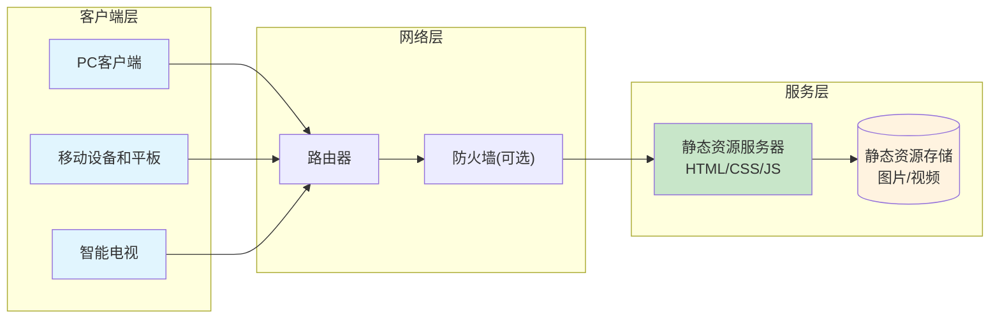

# Lark Signage (云雀数字标牌)

[中文](readme.md) [English](readme_en.md)

# 系统简介

英文全称: Lark Digital Signage，中文名：云雀数字标牌

小型数字标牌系统，纯前端页面，仅需要静态页即可，无需任何后端服务

# 应用场景

适用于有多个显示屏的小型的展厅介绍、广告推销等场景。

通过智能电视、平板、PC显示器等进行自动播放图片和视频，并需要远程更新相关展示内容。

# 功能清单

1. 支持自定义多个主题，每个是独立的内容资源
2. 提供首页，可以通过电视遥控器或鼠标键盘等选择不同页面
3. 资源支持图片和视频，支持资源的自动/循环播放
4. 如果就一个资源，图片则一直展示，视频则循环播放
5. 支持自动定时更新资源内容
6. 支持强制/定时刷新，避免缓存
7. 管理员只要修改服务器的配置文件和资源文件即可实现远程更新
8. 通过浏览器实现播放，所以支持的设备只要支持浏览器即可(电视/平板/PC等均可)
9. 支持设置默认语言和中英文切换

# 网络拓扑



# 基本原理

1. 通过系统自带浏览器进行播放和展示
2. 定时检测状态，并进行自动更新内容
3. 管理权限依赖于对静态资源的配置权限

# 能力要求

1. 可以理解json格式，修改配置文件
2. 理解静态服务器，并搭建静态网页
3. 会操作电视机打开浏览器
4. 会使用遥控器😄
5. 如果能懂tailwind的css中颜色和图标配置更好

# 操作说明

## 配置

1. 修改根目录 config.txt 文件
2. 在根目录下建立不同的文件夹，按 config.txt 的内容配置相关资源文件

配置文件说明如下：

```json
{
    "lang": "zh-CN", // 默认语言 zh-CN en-US
    "columns":2, // 当宽度大于768px时一行放几列，不超过12列，默认为2
    "content":[
        // 详细节点说明
        {
            "topic":"房间1",  // 必填，表示唯一的主题，会显示在首页按钮上
            "color" :"", // 按钮颜色样式，不填则按 #4F46E5 #10B981 #F97316 #334155 #E11D48 #0EA5E9 #7C3AED #D97706 循环
            "icon" :"fa-file-text-o", // 按钮图标css，使用 tailwind的图标，不填则按 fa-file-text-o fa-image fa-video-camera fa-camera fa-film fa-microphone fa-stop-circle fa-download 循环
            "path":"房间1",   // 相对根目录的子目录名不填则和topic一样
            "resList":["1.jpg","2.jpg","3.jpg"],  // 支持图片和视频格式，优先级比 resRange 高，默认为空，如果资源不存在则会跳过，
            "resRange":["1-6.jpg","1-2.mp4"],  // 根据资源范围自动检测资源，如果资源不存在则会跳过，格式为:数字开始-数字结束.后缀名, 比如 001-003.jpg，表示["001.jpg","002.jpg","003.jpg"]，默认 ["1-6.jpg","1-2.mp4"]
            "detectSec": 60,  // 检测间隔秒数，多少时间读取一次配置文件，默认60秒
            "version" : 1, // 任意数字，只要检测时发现变化则刷新资源(不刷新页面)，在更新图片视频资源后，但文件名没改变时需要修改此参数，本节点的其他信息任意改变将导致整个页面重新刷新
            "duration":5, // 播放间隔秒数,默认5秒
        },
        // 简化版本节点如下
         {
            "topic":"房间2",  // 必填，表示唯一的主题，会显示在首页按钮上
        }
    ]
}
```


## 部署

1. 需要有支持静态文件的服务器，比如Nginx，Apache，IIS 等
2. 将整个文件夹放到静态文件服务器对应的目录

## 使用

1. 打开浏览器(电视/平板/PC上自带或安装chrome浏览器)
2. 访问之前配置地址的静态页目录的 Index.html文件即可访问
3. 电视上可使用遥控器的上下左右进行选择，OK键进行确认

## 管理

1. 首先需要可以读写服务器上的文件资源，可通过远程登录或FTP等多种方式
2. 修改资源内容，直接按 config.txt 的要求修改配置文件
3. 将对应的资源复制到对应的文件目录

## 演示

直接将本仓库放到静态文件服务器上，输入对应网址的 index.html即可访问

# 注意事项

1. 因为使用浏览器自带的视频解析器，所以视频编码格式需要浏览器支持，有的电视浏览器版本较低可能对有些视频无法解析。

2. 展示界面会显示分辨率，可根据分辨率定制资源图片或视频

3. 如果图标无法载入，可能是有些静态服务器(如IIS)默认不支持woff2格式，请配置文件扩展名： .woff2 的 MIME 类型： font/woff2

4. 如果需要长期播放，有些设备比如平板或电视，长期开着浏览器可能会自动锁屏或休眠，请在设置中关闭

5. 每个终端都要预先操作一次，如果需要开机后自动打开，则每个终端需要编写对应的脚本自动打开指定页面

6. 浏览器版本要求如下：

   | 浏览器  | 支持版本 | 备注        |
   | ------- | -------- | ----------- |
   | Chrome  | 42+      | 2015 年发布 |
   | Firefox | 39+      | 2015 年发布 |
   | Safari  | 10.1+    | 2017 年发布 |
   | Edge    | 14+      | 2016 年发布 |
   | Opera           | 29+   | 2015 年发布 |
   | iOS Safari      | 10.3+ | 2017 年发布 |
   | Android Browser | 76+   | 2019 年发布 |

# 其他说明

1. 属于小型系统，主要是设计思路，代码实现方面，使用AI辅助快速开发实现，UI框架使用tailwind
2. 如果要修改系统内置的说明，直接修改 js/lang.js中的内容即可，键名为DOM对象ID，键值为显示的文本内容
3. 在自动检测资源时，默认图片的加载超时为10秒，视频加载超时为60秒，如果需要调整可在show.js中函数 validateVideo 和 validateImage 中调整