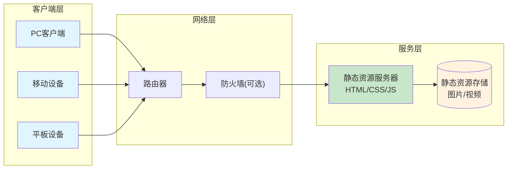

# Lark Signage (云雀数字标牌)

# 系统简介

英文全称: Lark Digital Signage，中文 云雀数字标牌

无服务器版小型数字标牌系统，纯前端页面，仅需要静态页即可，无需任何后端服务

# 功能清单

1. 支持自定义定义多个页面独立的内容资源
2. 提供首页，可以通过电视遥控器或鼠标键盘等选择不同页面
3. 资源支持图片和视频，支持资源的自动/循环播放
4. 如果就一个资源，图片则一直展示，视频则循环播放
5. 支持自动定时更新资源内容
6. 支持强制/定时刷新，避免缓存
7. 管理员只要修改服务器的配置文件和资源文件即可实现远程更新
8. 通过浏览器实现播放，所以支持的设备只要支持浏览器即可(电视/平板/PC等均可)

# 网络拓扑

# 能力要求

1. 可以理解json格式，修改配置文件
2. 理解静态服务器，并搭建静态网页
3. 会操作电视机打开浏览器
4. 会使用遥控器😄

# 操作说明

## 配置

1. 修改根目录 config.js 文件
2. 在根目录下建立不同的文件夹，按config.js的内容配置相关资源文件

## 部署

1. 需要有支持静态文件的服务器，比如Nginx，Apache，IIS 等
2. 将整个文件夹放到静态文件服务器对应的目录

## 使用

1. 打开浏览器(电视/平板/PC上自带或安装chrome浏览器)
2. 访问之前配置地址的静态页目录的 Index.html文件即可访问
3. 电视上可使用遥控器的上下左右进行选择，OK键进行确认

## 管理

1. 如果需要修改资源内容，直接按config.js的要求修改配置文件即可

# 注意事项

因为使用浏览器自带的视频解析器，所以视频编码格式需要浏览器支持，有的电视浏览器版本较低可能对有些视频无法解析。

# 其他说明

属于超小型系统，重要的是思路，代码实现方面，使用AI辅助快速开发实现