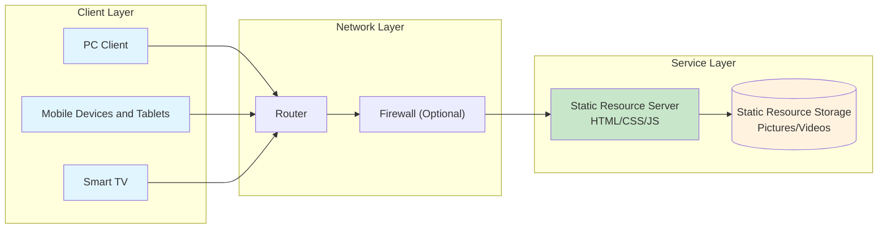

# Lark Signage (云雀数字标牌)

[中文](readme.md) [English](readme_en.md)

# System Introduction

English full name: Lark Digital Signage, Chinese name: 云雀数字标牌

A small digital signage system with pure front-end pages, requiring only static pages and no back-end services.

# Application Scenarios

Suitable for small exhibition hall introductions, advertising promotion and other scenarios with multiple displays.

Automatically play pictures and videos through smart TVs, tablets, PC monitors, etc., and support remote update of related display content.

# Feature List

1. Support custom multiple themes, each with independent content resources
2. Provide a homepage, which allows selecting different pages via TV remote control, mouse, keyboard, etc.
3. Support pictures and videos as resources, with automatic/cyclic playback
4. If there is only one resource, the picture will be displayed all the time, and the video will play in a loop
5. Support automatic timed update of resource content
6. Support forced/timed refresh to avoid caching issues
7. Administrators can achieve remote updates by simply modifying the server's configuration files and resource files
8. Playback is realized through a browser, so supported devices only need to support browsers (TVs/tablets/PCs, etc.)
9. Supports setting a default language and switching between Chinese and English

# Network Topology



# Basic Principles

1. Playback and display through the system's built-in browser
2. Regularly detect the status and automatically update content
3. Management permissions depend on the configuration permissions of static resources

# Capability Requirements

1. Able to understand JSON format and modify configuration files
2. Understand static servers and set up static web pages
3. Know how to operate a TV to open a browser
4. Know how to use a remote control 😄
5. It is better to understand color and icon configurations in Tailwind's CSS

# Operation Instructions

## Configuration

1. Modify the config.txt file in the root directory
2. Create different folders in the root directory and configure related resource files according to the content of config.txt

The configuration file is explained as follows:

```json
{
    "lang": "zh-CN", // Default language: zh-CN, en-US
    "columns":2, // Number of columns displayed in one line when the width is greater than 768px, no more than 12 columns, default is 2
    "content":[
        // Detailed node description
        {
            "topic":"Room 1",  // Required, represents a unique theme, will be displayed on the homepage button
            "color" :"", // Button color style, if not filled, it will cycle according to #4F46E5 #10B981 #F97316 #334155 #E11D48 #0EA5E9 #7C3AED #D97706
            "icon" :"fa-file-text-o", // Button icon CSS, using Tailwind's icons, if not filled, it will cycle according to fa-file-text-o fa-image fa-video-camera fa-camera fa-film fa-microphone fa-stop-circle fa-download
            "path":"Room 1",   // Subdirectory name relative to the root directory, if not filled, it is the same as topic
            "resList":["1.jpg","2.jpg","3.jpg"],  // Support picture and video formats, with higher priority than resRange, default is empty, skip if resources not existing. 
            "resRange":["1-6.jpg","1-2.mp4"],  // Automatically detect resources according to the resource range, skip if resources not existing. Format: start number-end number.suffix, e.g., 001-003.jpg represents ["001.jpg","002.jpg","003.jpg"], default ["1-6.jpg","1-2.mp4"]
            "detectSec": 60,  // Detection interval in seconds, how often to read the configuration file, default is 60 seconds
            "version" : 1, // Any number, resources will be refreshed (without refreshing the page) if a change is detected. This parameter needs to be modified when image/video resources are updated but file names remain unchanged. Any change in other information of this node will cause the entire page to refresh
            "duration":5, // Playback interval in seconds, default is 5 seconds
        },
        // Simplified version node as follows
         {
            "topic":"Room 2",  // Required, represents a unique theme, will be displayed on the homepage button
        }
    ]
}
```

## Deployment

1. A server that supports static files is required, such as Nginx, Apache, IIS, etc.
2. Put the entire folder into the corresponding directory of the static file server

## Usage

1. Open a browser (built-in browser on TV/tablet/PC or installed Chrome browser)
2. Access the Index.html file in the static page directory of the previously configured address to access
3. On TV, you can use the up, down, left, and right keys of the remote control to select, and press the OK key to confirm

## Management

1. First, you need to be able to read and write file resources on the server, which can be done through remote login or FTP and other methods
2. To modify resource content, directly modify the configuration file according to the requirements of config.txt
3. Copy the corresponding resources to the corresponding file directory

## Demonstration

Upload this repository directly to a static file server, then enter the `index.html` file path of the corresponding URL to access it.

# Notes

1. Because the browser's built-in video parser is used, the video encoding format needs to be supported by the browser. Some TV browsers with lower versions may not be able to parse some videos.

2. The display interface will show the resolution, and resource pictures or videos can be customized according to the resolution

3. If icons fail to load, it may be because some static servers (such as IIS) do not support the woff2 format by default. Please configure the MIME type for the file extension `.woff2` as `font/woff2`.

4. If long-term playback is required, some devices (such as tablets or TVs) may automatically lock the screen or enter sleep mode when the browser is left open for an extended period. Please disable this feature in the device settings.

5. Each terminal needs to be preconfigured once. If you want it to open automatically after booting up, you need to write a corresponding script for each terminal to launch the specified page automatically.

6. Browser version requirements are as follows:

   | Browser         | Supported Version | Remarks               |
   | --------------- | ----------------- | --------------------- |
   | Chrome          | 42+               | Released in 2015      |
   | Firefox         | 39+               | Released in 2015      |
   | Safari          | 10.1+             | Released in 2017      |
   | Edge            | 14+               | Released in 2016      |
   | Opera           | 29+               | Released in 2015      |
   | iOS Safari      | 10.3+             | Released in 2017      |
   | Android Browser | 76+               | Released in 2019      |

# Other Instructions

1. It is a small system, mainly focusing on design ideas. In terms of code implementation, it is quickly developed with AI assistance, and the UI framework uses Tailwind.
2. If you want to modify the system's built-in descriptions, simply edit the content in `js/lang.js`. The key name is the DOM element ID, and the key value is the displayed text content.
3. During automatic resource detection, the default timeout for image loading is 10 seconds, and for video loading is 60 seconds. If adjustments are needed, you can modify the values in the `validateVideo` and `validateImage` functions within `show.js`.